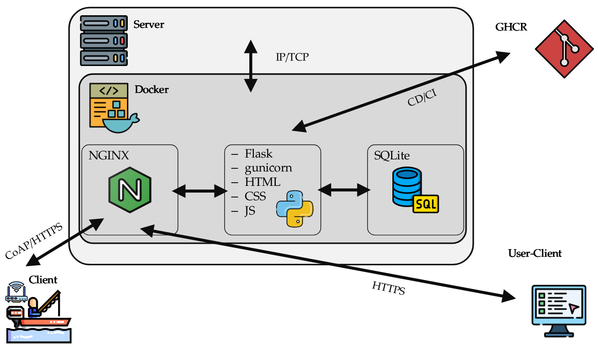
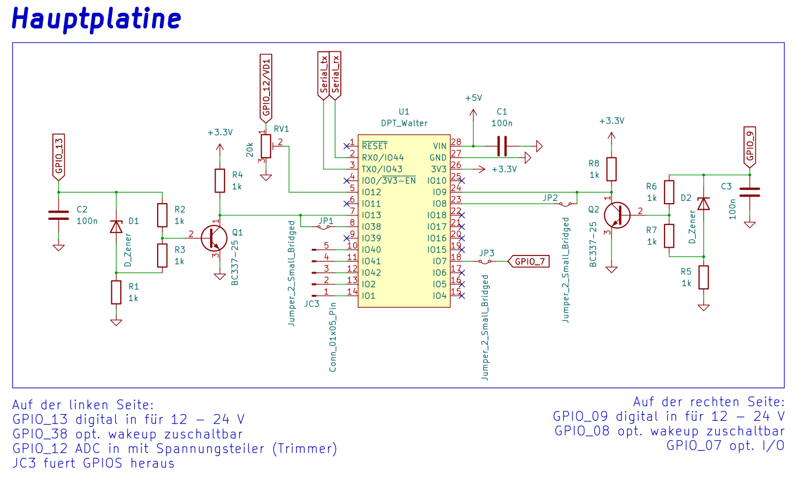
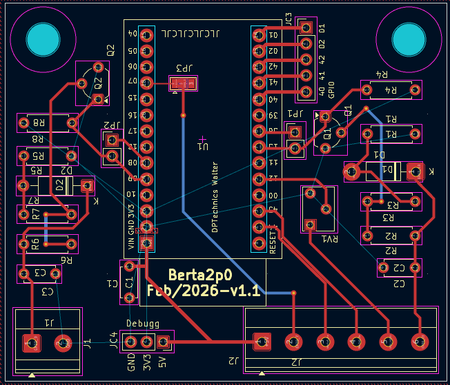
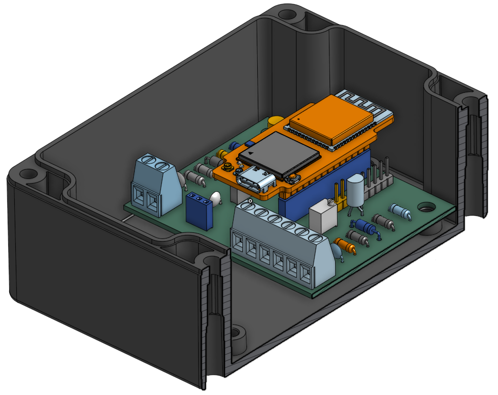
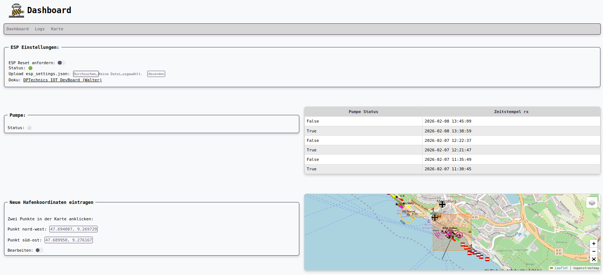
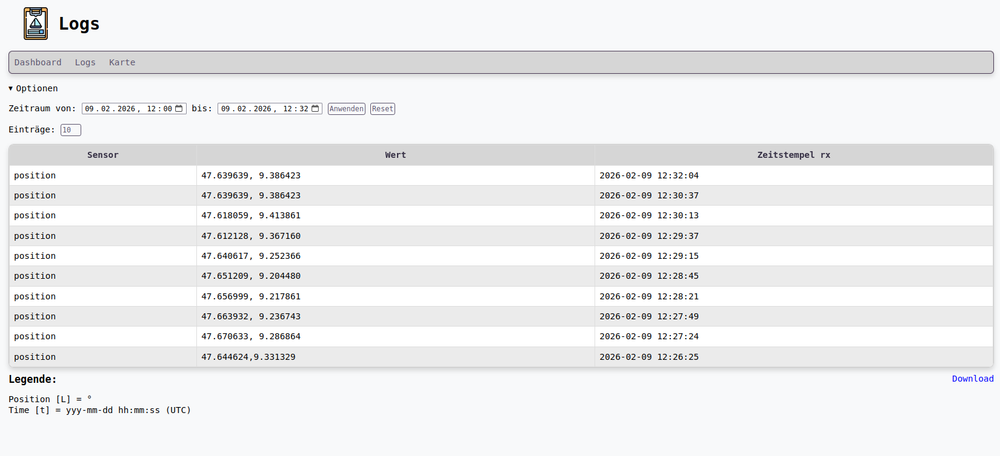
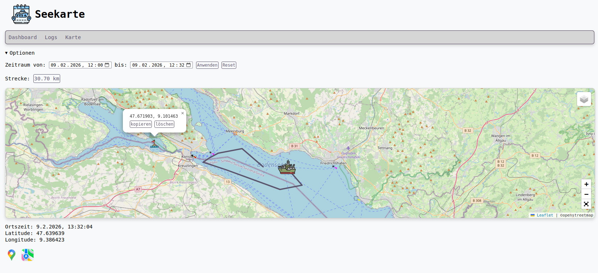
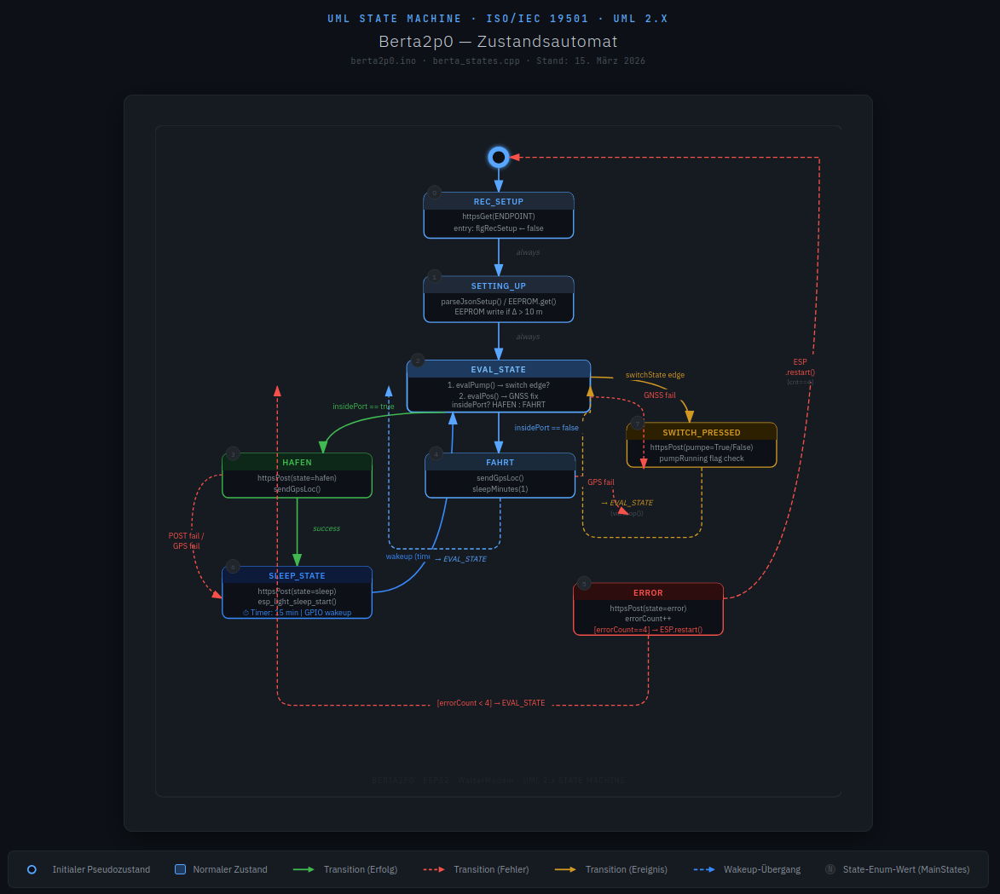

### Lage:

Ein Sportboot wird von mehreren Parteien genutzt. Darüber hinaus ist es mit einer automatischen Lenzpumpe ausgestattet, die bei Regenfall das im Boot anfallende Wasser abpumpt. Um die aktuelle Position des Bootes für alle Beteiligten sichtbar zu machen, gefahrene Routen nachvollziehen zu können und zusätzlich zu erkennen, ob die automatische Pumpe tatsächlich aktiv war, wurde das folgende Projekt umgesetzt.  

# DPTechnics Walter Boat-tracker

Das obenstehende Projekt nutzt die [GNSS](https://de.wikipedia.org/wiki/Globales_Navigationssatellitensystem)- und LTE-Funktionalität des [DPTechnics Walter Dev Boards](https://www.quickspot.io/index.html), um Positions- und Sensordaten eines Sportbootes zu erfassen und an ein serverseitiges Backend zu übertragen. Dieses speichert die empfangenen Daten in einer Datenbank und bereitet sie in einem [Webfrontend](#Walktrough) zur Darstellung auf.
Die nachfolgende Grafik stellt den Ablauf schematisch dar.

 

Der DPTechnics Walter sendet seine aktuelle Position sowie beliebige weitere Sensorwerte ([GPIO's](https://de.wikipedia.org/wiki/GPIO)) per CoAP oder [HTTPS](https://de.wikipedia.org/wiki/Hypertext_Transfer_Protocol) POST an die DynDNS-Adresse des Servers, der zusätzlich durch einen Reverse Proxy ([NGINX](https://de.wikipedia.org/wiki/Nginx)) abgesichert ist. Über entsprechende Routen werden die Daten mit einem Zeitstempel versehen und in eine SQLite-Datenbank geschrieben.

Zur Verarbeitung und Darstellung der Daten auf einem Webserver kommt serverseitig ein Python-[Flask](https://flask.palletsprojects.com/en/stable/deploying/)-Skript zum Einsatz. Der gesamte Datenaustausch erfolgt aktuell über API-Calls mit dem [Flask-Server](https://flask.palletsprojects.com/en/stable/deploying/). [Gunicorn](https://gunicorn.org/) fungiert dabei als [WSGI-Server](https://de.wikipedia.org/wiki/Web_Server_Gateway_Interface) und übernimmt das Handling mehrerer User-Clients sowie die [WSGI-HTTPS](https://de.wikipedia.org/wiki/Web_Server_Gateway_Interface)-Übersetzung.

Über die Website können Anfragen – beispielsweise zur aktuellen Position des Bootes – an den Server gestellt werden. Dieser liest die entsprechenden Daten aus der Datenbank aus und übergibt sie an das JavaScript der Webseite, welches sie visuell darstellt.

Für ein zweckmäßiges [CD/CI-Setup](https://de.wikipedia.org/wiki/CI/CD) wurde für den privaten Einsatz die [GitHub Container Registry (GHCR)](https://github.blog/news-insights/product-news/introducing-github-container-registry/) gewählt. Diese kann alternativ problemlos durch den offiziellen [Docker Hub](https://www.docker.com/products/docker-hub/) ersetzt werden ([Infos zu Containerization](https://en.wikipedia.org/wiki/Containerization_(computing))). Entsprechende [Crontabs](https://de.wikipedia.org/wiki/Cron) oder [Webhooks](https://de.wikipedia.org/wiki/Webhook) sind derzeit eigenständig zu implementieren.

# Getting started

Notwendige Hardware- und Softwareanpassungen werden in den folgenden Kapiteln erläutert.

## Prerequisits

> [!NOTE]
>
> * Voraussetzung ist eine eigene global erreichbare IP oder [DynDNS-Adresse](https://de.wikipedia.org/wiki/Dynamisches_DNS). Sehr zu empfehlen ist der kostenlose DynDNS-Host [IPv64.de](https://ipv64.net/)
> * Ebenso wird ein bereits installierter Reverse Proxy o. ä. wie [NGINX](https://nginx.org/) für eine einfache [Let's-Encrypt](https://de.wikipedia.org/wiki/Let%E2%80%99s_Encrypt)-[TLS](https://de.wikipedia.org/wiki/Transport_Layer_Security)-Zertifizierung und optionales Loadbalancing benötigt.
> * Zusätzlich wird eine vorhandene Docker- bzw. Docker-Compose-Installation vorausgesetzt. Siehe [Docker Doku](https://docs.docker.com/engine/install/)
> * Für die Programmierung des ESP32 wurde die [Arduino IDE](https://docs.arduino.cc/software/ide/) verwendet. Details zur Verwendung der Development-Toolchain in der [Arduino IDE](https://docs.arduino.cc/software/ide/) befinden sich in der [DPTechnics Walter Doku](https://www.quickspot.io/documentation.html#/developer-toolchains/arduino)

## Hardware

Das folgende Kapitel erläutert die getroffenen hardwareseitigen Maßnahmen und listet die verwendeten Bauteile auf.

### ESP32 GPIOS

Um die 12 V- und 24 V-Spannungen des Bordnetzes als 3.3 V-Logiksignale nutzbar zu machen, wurde die nachstehende Schaltung entworfen und auf einer Lochrasterplatine umgesetzt.



Die Schaltung für das Erkennen der Pumpe auf der linken Seite ist rechts gespiegelt, nachfolgend wird sich auf die linke Seite beschränkt. Die beim Schalten des Verbrauchers GPIO_13 (Pumpe) anliegende Spannung (Vcc_Boradnetz, 12 -24 V) wird über C2 geglättet und durch D1 auf 10 V begrenzt. Die Spannung am Spannungsteiler R2/R3 schaltet anschließend Q1. Die am Pull-up R4 anliegende Spannung von 3.3 V wird dadurch annähernd auf GND gezogen, wodurch die GPIO's 13 und 38 einen Flankenwechsel erkennen (Wake-up, Interrupt etc.). Dabei kann der [Interrupt/Wakeup](https://de.wikipedia.org/wiki/Interrupt) an GPIO_38 über den Jumper JP1 wahlweise dazugeschalten werden, wenn dieser bei einem Flankenwechsel an GPIO_13 aktiv sein soll. Möchte eine analoge Spannung über einen der internen [ADC's](https://de.wikipedia.org/wiki/Analog-Digital-Umsetzer) gemessen werden, kann das PCB um einen niederohmigen [Trimmer](https://de.wikipedia.org/wiki/Trimmer) an GPIO_12 erweitert werden. Um im weiterer Zukunft weitere [GPIO's](https://de.wikipedia.org/wiki/GPIO) nutzbar machen zu können wurden die GPIOs 40, 41, 42, 2, 1 und 7 an Buchsenleisten herausgeführt. Ebenfalls herausgeführt sind die Seriellen GPIOs 44 und 43, werden aber nicht verwendet. Pin 26 / GPIO_0 versorgt die 3.3 V Ebene des [PCB's](https://de.wikipedia.org/wiki/Polychlorierte_Biphenyle) mit 3.3 V, sowie GND die GND Ebene des zweilagigen PCB (Siehe nächste Abbildung).

Die Pull-up-Spannung wird über den internen [DC/DC-Wandler](https://de.wikipedia.org/wiki/Gleichspannungswandler) des [ESP](https://de.wikipedia.org/wiki/ESP32) selbst bereitgestellt (GPIO_0 = LOW), sofern der [ESP](https://de.wikipedia.org/wiki/ESP32) mit 3.3–5 V über USB-C oder Walter Pin 28 versorgt wird. Da die 3.3 V / 250 mA-Spannungsquelle ebenfalls den Sequans LTE/GNSS-[SoC](https://de.wikipedia.org/wiki/System-on-a-Chip) versorgt, ist es notwendig, neben den internen [Pull-ups](https://www.elektronik-kompendium.de/public/schaerer/pullr.htm) zusätzlich einen externen zu verwenden.

 

Die Bauteile bzw. die Schaltung wurde nach den Bauteilen entworfen, welche bereits in der Werkstatt des Autors vorhanden waren. Es mag durchaus bessere Lösungen geben. Die [Via's](https://de.wikipedia.org/wiki/Durchkontaktierung) sind einfach da weil der Platz vorhanden ist und warum nicht, kostet nicht mehr, tut niemandem weh und mir macht's Spaß.



DPTechnics Walter / ESP Pinning siehe -> [Doku](https://www.quickspot.io/documentation.html#/hardware/walter). Anschaulich dargestellt ist die fertige Hardware in der oberen Abbildung der Assembly.

> [!IMPORTANT]
> Wichtig ist eine konstante Spannungsquelle für den ESP. Eventuelle Laderegler von Powerbanks o. ä. beenden die Spannungsversorgung im Light- oder Deep-Sleep-Modus des ESP.

### Energieverbrauch

Das System bezieht im getesteten Szenario 9 mA/Tag (1 h im Zustand/State Fahrt, 23 h deep sleep).  
Im deep sleep Modus, also im Zustand/State Hafen, wird 9.1 µA verbraucht.

### Server

Als Server eignet sich grundsätzlich jede lauffähige Hardware. Hier wurde ein Raspberry Pi 5 mit 8 GB RAM verwendet.

### Teileliste

Mindest Anzahl 1x GPIO IN + 1x GPIO Wakeup + 1x ADC-Trimmer GPIO IN:

* Reichelt
  * 1x DPTechnics Walter
  * 4x 1k Widerstand MPR 1,00K
  * 1x 10 V Zener-Diode BZX 85C10 VIS
  * 1x 1x2 Jumper BKL 10120190
  * 1x 1x2 Stiftleiste BKL 10120909
  * 2x 1x14 Buchsenleiste BKL 10120952
  * 1x 1x3 Buchsenleiste BKL 10120717
  * 1x 1x5 Buchsenleiste BKL 10120643
  * 1x Schraubklemme CTB0502-2
  * 2x Schraubklemme CTB0102-3
  * 1x Trimmer 10k 64Y-10K
  * 1x PCB oder Lochrasterplatine LR-DS-KIT
  * 1x Gehäuse 3215000,0H
* Amazon

  * 1x [8 Ader 10AWG Kabel](https://www.amazon.de/dp/B0F2J3JX1M?ref=ppx_yo2ov_dt_b_fed_asin_title)
  * 1x [USB-A DC/DC Wandler 12-5 V](https://www.amazon.de/dp/B0D471BSR2?ref=ppx_yo2ov_dt_b_fed_asin_title)
  * 1x [Schraubverbinder](https://www.amazon.de/dp/B0CYLPM7T7?ref=ppx_yo2ov_dt_b_fed_asin_title)
  * 1x [Sicherungshalter](https://www.amazon.de/dp/B00H3CVSXQ?ref=ppx_yo2ov_dt_b_fed_asin_title)
  * 1x [100 mA Sicherung](https://www.amazon.de/BOJACK-sicherungen-Sortiment-transparenten-Kunststoffbox/dp/B07TF68QZC/ref=sr_1_1_sspa?__mk_de_DE=%C3%85M%C3%85%C5%BD%C3%95%C3%91&crid=N28PGBRT44MQ&dib=eyJ2IjoiMSJ9.sPdAgH-rSnJFHYjegg6Dek2Q75fIi0S6McFGhtfZCjzgh_EctIML_GrF6OmgXMo4czIO8cW98SZEgSEyAAEJxmwuqdoz92V_l-mYqf2NKlNrb9KftnxUi-83u6B079BJfZob5SS1ncg14YnqM1RtYm1rnb2NeMVneedfPabSAqy4ZyhohT7ycUOSktVEu5QRGCjuL90_8qmFwU3k02jZVjznu-b97ms8FXkPfLcSCucvuZw9p0O4m7MyqG4ajsIcs_8uYud1AMbCneMqnoGVlf6sbl-t8s_liqoBa6SfKPQ.GSThK7u_IChCK4kmN7Saj6kUuYZNWmGNsO2dPPZifQI&dib_tag=se&keywords=sicherung%2B150%2BmA%2BF&qid=1770633179&sprefix=sicherung%2B150a%2Bf%2Caps%2C123&sr=8-1-spons&aref=S2wg4qFQ5A&sp_csd=d2lkZ2V0TmFtZT1zcF9hdGY&th=1)
* Bereits vorhanden sein sollte:

  * Altes USB-A Kabel zum verbasteln
  * Crimps etc.

## ESP32S3 Code

Damit der ESP32 die Sensorwerte an den Server senden kann, müssen folgende Parameter in der .ino bzw. den Header-Files des ESP-Codes an den entsprechenden Stellen eingetragen werden:

* IP / URL:

```
#define HTTPS_HOST "adresse.home64.de"

```

* Ports:

```
#define HTTPS_PORT 443
```

* GET / POST Endpoints: (wenn andere gewünscht)

```
#define HTTPS_GET_ENDPOINT "/daten"
#define HTTPS_POST_ENDPOINT "/daten"
```

* BasicAuth Zugangsdaten

```
#define HTTP_USER "user"
#define HTTP_PASS "userpasswort"
```

* **Einmalig** TLS CA:
  Dabei wird das [CA-Zertifikat](https://en.wikipedia.org/wiki/Certificate_authority) mit `PROGMEM` im [Flash](https://de.wikipedia.org/wiki/Flash-Speicher) des ESP32 gespeichert.

```
const char ca_cert[] PROGMEM = R"EOF(
-----BEGIN CERTIFICATE-----
/*Hier CA einfuegen*/
-----END CERTIFICATE-----
)EOF";
```

Die `.tlsWriteCredential()` Methode in `setupTLSProfile()` sollte demnach auch nur einmal nach Eintragung des [CA-Zertifikat](https://en.wikipedia.org/wiki/Certificate_authority) ausgeführt werden. Danach darf der Teil gerne auskommentiert werden (siehe Codebeispiel unten). Anschließend wird das [CA-Zertifikat](https://en.wikipedia.org/wiki/Certificate_authority) beim Setup des TLS-Profils aus dem Flash geladen.

```
bool setupTLSProfile(void){
  // Sollte nur bei Aenderung des CA certs und nach Firmwareupgrade aufgerufen werden
  /*if(!modem.tlsWriteCredential(false, 12, ca_cert)) {
    Serial.println("Error: CA cert upload failed");
    return false;
  }*/

  if(modem.tlsConfigProfile(HTTPS_TLS_PROFILE, WALTER_MODEM_TLS_VALIDATION_CA,
                            WALTER_MODEM_TLS_VERSION_13, 12)) {
    Serial.println("INFO: TLS profile configured");
  } else {
    Serial.println("ERROR: TLS profile configuration failed");
    return false;
  }

  return true;
}
```

> [!TIP]
> Welche [TLS-Version](https://ssl.de/ssl-faq/welche-tls-versionen-gibt-es.html) auf dem eigenen Server verwendet wird, kann mit [openssl](https://openssl.org/) überprüft werden:
>
> ```
> openssl s_client -connect adresse.de:0000 -tls1_2
> ```
>
> Dort einfach alle drei Versionen durchprobieren.
> Das verwendete CA lässt sich am besten über einen beispielhaften [POST](https://en.wikipedia.org/wiki/POST_(HTTP)) via [curl](https://curl.se/) im Terminal ermitteln:
>
> ```
> curl --trace-ascii debug.txt -u username:userpw -X POST https://adresse.de/end-point -d "sensor=test&wert=42"
> ```

## Python Server

Die folgenden serverseitigen Einstellungen sind in der [settings.json](https://de.wikipedia.org/wiki/JSON) vorzunehmen:

* User / Passwort:
  In der settings.json sind die Standardnutzer und Standardpasswörter zu ersetzen. Diese werden in der server.py geparsed und begrenzen über [Decorators](https://de.wikipedia.org/wiki/Decorator) den Zugriff auf die jeweiligen Routen.

```
{
    "users": {
        "admin": "adminpasswort",
        "user": "userpasswort"
    }
}
```

* Ports:
  Bei Bedarf kann der Port in der docker-compose.yml auf den Wunschport YYYY geändert werden
> [!CAUTION]
> Docker Überschreibt die internen IP Tables der [UFW](https://de.wikipedia.org/wiki/Uncomplicated_Firewall)(Firewall)! Unbedingt beim  betreiben auf einem [VPS](https://cloud.google.com/learn/what-is-a-virtual-private-server?hl=de) eine vor dem Server liegende Firewall verwenden und [Ports](https://de.wikipedia.org/wiki/Port_(Netzwerkadresse)) in der docker-compose.yml auf [local host (127.0.0.1)](https://de.wikipedia.org/wiki/Localhost) binden.  
  
```
    Ports:
    - 127.0.0.1:YYYY:5000
```

## Instalation

Durch die Docker-Kapselung gestaltet sich die Installation denkbar einfach durch Klonen des [Repos](https://de.wikipedia.org/wiki/Repository)

```
git init
git clone 
```

und Ausführen der docker-compose.yml

```
docker compose up -d
```

# Walktrough

## ESP32

Welche Werte gesendet werden sollen sowie weitere Einstellungen wie die Hafenkoordinaten erhält der ESP durch einmaliges Herunterladen der [esp_settings.json](https://de.wikipedia.org/wiki/JSON) bei jedem Neustart. Weiteres dazu im [Dashboard](#dashboard).  

### Funktion

Die State-Machine des ESP32 kennt zwei Grundzustände: Hafen und Fahrt. Nach dem Start evaluiert der ESP seinen Zustand durch Messen der aktuellen Position und Vergleich mit den hinterlegten Hafenkoordinaten (esp_settings.json).

Befindet sich der ESP im Hafen, sendet er diesen Zustand an den Server/die Website und geht anschließend für 15 Minuten in den Light-Sleep-Modus, bevor er seine Position erneut evaluiert.

Befindet sich der ESP außerhalb des Hafens, befindet er sich im Zustand Fahrt und sendet seine Position im 1-Minuten-Takt an den Server/die Website. Ob die Pumpe läuft (`GPIO_PIN_13 == HIGH`) wird dabei über Interrupts in jedem Zustand erkannt und an den Server gemeldet.

Über Modifizierung der HTTPS [POST's](https://en.wikipedia.org/wiki/POST_(HTTP)) können beliebige Werte gesendet werden. Der Server und die Datenbank übernehmen diese automatisch, sofern sie der folgenden Syntax folgen:

```
curl -u admin:adminpasswort -X POST -d "sensor=<EIGENER_WERT>>&wert=<EIGENER_WERT>" https://adresse.de:5000/daten
```

## Dashboard



Über das Dashboard werden jene Eigenschaften und Parameter festgelegt, die später vom ESP nach einem Neustart in Form der esp_setting.json übernommen werden – insbesondere die Hafenkoordinaten.

## Logs



Im Reiter "Logs" werden alle [POST's](https://en.wikipedia.org/wiki/POST_(HTTP)) des ESP dargestellt. Über das Formular können diese nach Zeitraum gefiltert werden.

## Karte



Im Reiter Karte wird die aktuelle bzw. letzte Position des ESP/Bootes dargestellt. Über das Formular oberhalb der Karte kann der Positionsverlauf (Fahrt/Trip) visualisiert und nachvollzogen werden. Das Zeitformat im Datumsformular entspricht [UTC](https://de.wikipedia.org/wiki/Koordinierte_Weltzeit), die Anzeige in der Karte UTC + Z. Durch Klicks in der Map können Bojen/Positionsmarker gesetzt werden (rein visuell und zur Positionsanzeige).\
Über die Google Maps- und Apple Maps-Buttons gelangt man zur aktuellen Position in der entsprechenden App.

# Code
Die nachfolgenden Kapitel erläutern die grobe Struktur und den Aufbau des ESP32 Codes sowie die des Python Backends.
## ESP32
Der ESP Code besteht aus einem Setup Teil und einem Cooperative Scheduler in den folgenden Files:  
berta_2p0_ESP32.ino: Hauptfile (Setup+Scheduler, main.c)  
berta.h  
berta.c: Setup- und Hilfsfunktionen  
berta_states.h  
berta_states.c: States und Hilfsfunktionen der States  

### Setup
```
setup(){
}
```
Der Setupteil (berta_2p0_ESP32.ino) beginnt mit der Konfiguration des [Watchdogs](https://de.wikipedia.org/wiki/Watchdog), welcher nur im Setup läuft, die [Statemachine](https://de.wikipedia.org/wiki/Endlicher_Automat) hat ein eigenes Fehlermanagement. Im Anschluss werden die GPIO's und Wakeups konfiguriert, welche in der Statemachine für das Aufwachen und Detektieren verantwortlich sind, wenn ein Anschalten der Pumpe erkannt wird. Zuletzt wird der [EEPROM](https://de.wikipedia.org/wiki/Electrically_Erasable_Programmable_Read-Only_Memory), GNSS, TLS und HTTPS konfigureirt. Im EEPROM werden nur die Hafenkoordinaten gespeichert und nur Überschrieben wenn neue Koordinaten im Backend vorliegen. Details zu GNNS, TLS und HTTPS sind der [DPTechnics Walter Doku](https://www.quickspot.io/documentation.html#/) zu entnehmen.

### Scheduler und State Machine
```
while(1) {
    switch (mainState){
      case REC_SETUP:       // 0
        recSetup();
        break;
        ...
    }
  }
}
```

Der die Logik zum senden der Positions und Sensordaten wurde im Rahmen eines einfachen [Cooperative Schedulers](https://en.wikipedia.org/wiki/Cooperative_multitasking) umgesetzt (berta_2p0_ESP32.ino). Dieser unterscheidet zwischen den folgenden States (mainStates):  
Die folgende Grafik (Erstellt mit KI Claude Code) verdeutlicht den Ablauf. Die Pfeile zeigen etwas durch die Gegend aber wenn man sich an Der Farbe und der Richtung orientiert passt alles.  

```
enum MainStates { 
    REC_SETUP, // 0
    SETTING_UP, // 1
    EVAL_STATE, // 2
    HAFEN, // 3
    FAHRT, // 4
    ERROR, // 5
    SLEEP_STATE, // 6
    SWITCH_PRESSED // 7
};
```
 
Im Setupteil wird der mainState zunächst auf REC_SETUP gesetzt.  
**REC_SETUP**: In diesem State wird die esp_settings.json vom Server geladen, in welcher sich zur Zeit nur die Hafenkoordinaten befinden und welche ebenfalls über das Dashboard im Webinterface bearbeitet werden kann.  
**SETTING_UP**: Vergleicht ob die im EEPROM hinterlegten Hafenkoordinaten denen in der JSON entsprechen und überschreibt diese, falls geändert.  
**EVAL_STATE**: Zunächst wird der Zustand der GPIOs überprüft, ist die Pumpe aktiv, wird in den Zustand SWITCH_PRESSED gewechstelt. Danach fordert wird ein GNSS Fix angefordert und Vergleichen ob der erhaltene Fix innerhalb der Hafenkoordinaten liegt oder nicht. Da nicht detektiert werden kann ob der Motor läuft oder nicht, wird hierüber bestimmt ob sich das Boot im Hafen befindet oder außerhalb, in Fahrt. Befindet sich das Boot im Hafen wird in den Zustand Hafen gewechselt. Befindet sich das Boot außerhalb der Hafenkoordinaten wird in den Zustand Fahrt gewechselt.  
**HAFEN**: Der ESP sendet den Zustand Hafen ans Backend und welchselt in den Zustand SLEEP_STATE.  
**FAHRT**: Der ESP sendet die aktuelle Position ans Backend. Befindet sich das Boot weiterhin außerhalb des Hafens, wird eine Minute gewartet und wieder in EVAL_STATE gewchselt.  
**ERROR**: Wird in irgendeiner Funktion als Rückagbewert `false` detektiert, beispielsweise beim Verbindungsaufbau mittels LTE, wird automatisch in den Zustand ERROR gewechselt. Wurde während der Laufzeit 5 mal in den Zustand ERROR gewechselt, führt der ESP beim 5. Wechsel in den ERROR Zustand einen Softwarereset durch.  
**SLEEP_STATE**: Der Wakeuppin wird konfiguriert, sodass dieser den ESP bei Aktivierung wieder aus dem Sleepmode aufwecken kann (Pump wird während sleep aktiv). Im Anschluss wird für 15 Minuten in den light sleep des ESP gewechselt. Nach dem Aufwachen (nach 15 min. oder wakeup) wird der Wakeuppin deaktiviert und in den Zustand EVAL_STATE gewechselt.  
**SWITCH_PRESSED**: Wurde die Pumpe aktiviert (0 V zu 12 V an `SWITCH_PIN`) wird dieser Zustand als `pumpe = True` ans Backend gesendet, ebenso wenn der Wechsel von 12 V an 0 V statt findet, dann eben `pumpe = False`. Anschließend wird wieder in EVAL_STATE gewechselt (nur Flankenwechsel werden ans Backendgesendet, Pumpe an/aus).  

## Backend
Das Backend verfolgt die folgende Ordnerstruktur:  
- app
    - data
        - sensor_data.db
    - logs
        - app.log
    - static
        - dashboard
            - dashboard.js
        - index
            - index.js
        - karte
            - karte.js
        - logos.png
    - templates
        - base.html
        - dashboard.html
        - index.html
        - karte.html
    - esp_settings.json
    - settings.json
    - requirements.txt
    - server.py
    - bertaSetup.py
    - routes.py
- figures
    - figures.png
- befehle.txt
- docker-compose.yml
- Dockerfile
- README.md
  
 Über das Dockerfile und docker-compose.yml kann das Projekt selbst gebaut werden, wenn man nicht auf die Github Container Registry zurückgreifen will. Dazu befinden sich in der requirements.txt alle notwendigen Abhängigkeiten. In der befehle.txt befinden sich allerlei Befehle die sich im Verlauf des Projektes als hilfreich herausgestellt haben. Der Webserver wird bei Verwendung von Docker hinter Gunicorn laufen, kann aber auch als virtual environment unter Python laufen. Das Hauptfile ist hier die server.py. Über die bertaSetup.py werden die Zugangsdaten (Anmeldedaten) auf der Weboberfläche geladen und die Hilfsfunktionen initialisiert. Wurde in der server.py die Datenbank in /data erstellt und der Server gestartet, werden die Routen über die routes.py geladen. In der routes.py befinden sich auch die API Routen, welche bei Bedarf auch als externe api.py ausgelagert werden können. Die Webseiten werden aus den entsprechenden HTML Files in /templates erstellt, welche auf das JavaSrcipt in /static zurückgreifen, worin sich ebenfalls alle Logos und Grafiken befinden. Alle [Serverlogs](https://de.wikipedia.org/wiki/Logdatei) werden eigentlich an die Dockerausgabe weitergereicht, hier werden diese ebenfalls in ein eigenes Logfile in /logs geschrieben.

# Sonstiges

* Die Dokumentation zum Walter DevBoard befindet sich nochmals [hier](https://www.quickspot.io/documentation.html#/), samt dem Datenblatt [hier](https://www.quickspot.io/datasheet/walter_datasheet.pdf).
* Als Inspiration für den ESP32-Code dienten die DPTechnics Examples by [@Arnoud Devoogdt](arnoud@dptechnics.com).
* Die Icons in der Website stammen von [flaticon.com](https://www.flaticon.com/).
* Die OpenSeamap-Integration wurde durch [Leaflet](https://leafletjs.com/) ermöglicht.


